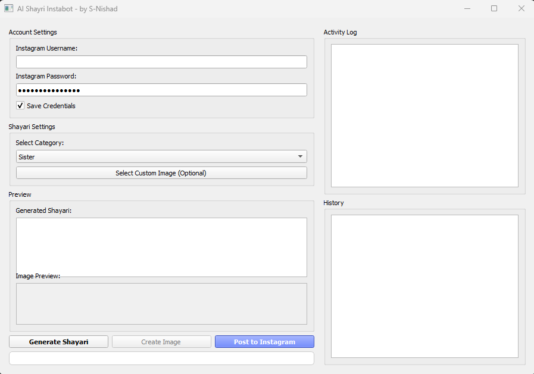

<div align="center">

# ✨ AI Shayri Instabot ✨

### _Create Beautiful Hindi Shayris with AI_  

[](https://en.wikipedia.org/wiki/India)
[](https://python.org)
[](LICENSE)

📷 **[Instagram](https://instagram.com/alon_boy.in)** | ✉️ **[Email](mailto:sn19nishad@gmail.com)** | 💻 **[Report Bug](https://github.com/S-Nishad/ai-shayri-instabot/issues)**




## 🌈 Features

| Feature | Description |
|---------|-------------|
| **🤖 AI Shayri Generation** | Creates authentic Hindi shayris in English script across 10+ emotional categories |
| **🎨 Smart Image Creation** | Beautiful text overlays with shadow effects and perfect centering |
| **📸 Instagram Ready** | One-click posting with auto-generated hashtags |
| **✏️ Editable Content** | Modify shayri before finalizing image |
| **📚 History Tracking** | Save and revisit all your creations |

## 🚀 Quick Start

```bash
# Clone the repository
git clone https://github.com/S-Nishad-up/ai_shayri_instabot.git
cd ai_shayri_instabot

# Install dependencies
pip install -r requirements.txt

# Launch the app
python main.py
